>
> **Status:** Playable but bugs are still very common
>

# PharoChipDesigner
A little chip design game inspired by Engineer of the People (kohctpyktop) by Zachtronics


## How to load

Supported Pharo versions: 8.0

```smalltalk
Metacello new
  baseline: 'ChipDesigner';
  repository: 'github://pavel-krivanek/PharoChipDesigner/src';
  load.
```

## Controls

|  | Normal mode |
| ------ | ------ |
| LMB | metal |
| RMB | N silicon (red) |
| Shift + RMB | P silicon (yelow) |
| V | next LMB will add a via |
| X | delete mode |
| S | single step |
| R | run simulation |

|  | Delete mode |
| ------ | ------ |
| LMB | delete metal |
| Shift + LMB | delete silicon |
| X | normal mode |

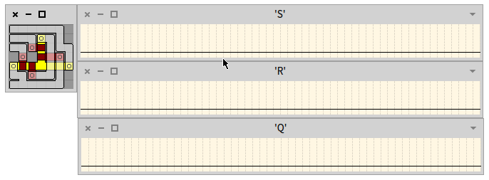

## Introduction

>
> The following text is a modified copy of an article describing the original game that was published on [https://nerdparadise.com/](https://nerdparadise.com) where it is no longer accessible. I'm not the original author of it. It can be visited on [archive.org](https://web.archive.org/web/20160404141949/http://nerdparadise.com/tech/electronics/circuits/kohctpyktop/)
>
> It is a great introduction to the concepts of the game. It mixes terms voltage and current.
>

When you start the game you are given a handful of circuit specifications and are expected to create them on the surface provided. You have metal inputs on the left and metal receivers for outputs on the right. On the top, you have a little toolbar where you can select metal, silicon (P and N type) and connectors and lay it down on the board.

Intimidating, yes.

On the scope tab below, you can run some predefined tests to determine if your circuit works. It will run current from the inputs and check the outputs for accuracy based on the specs.\
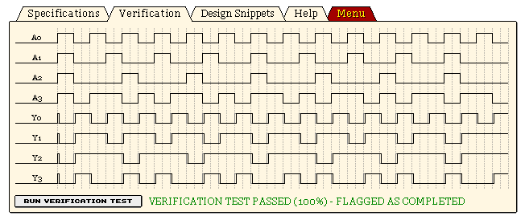

So back to laying down metal and silicon...\
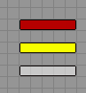\
N silicon, P silicon, and metal, respectively.

All these materials are capable of carrying current, but only metal can connect to the inputs or outputs...\
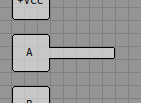

Metal and silicon can pass over each other on the board without the currents from each interferring unless you add a connector (the little circle thing, 3rd in your toolbox). However, when you try to cross two different colors of silicon, you get something like this...

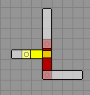\
This is a gate.

There are two sorts of gates...

NPN Gate
--------

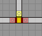

Ordinarily silicon will let current travel like metal, but if P (yellow) silicon crosses N (red) silicon, current will only travel through the N (red) silicon if the P (yellow) silicon is also carrying a current. Otherwise, the N (red) silicon will not carry a current across.

PNP Gate
--------

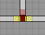

This is just the opposite. When N silicon crosses P silicon, current will not continue through if the N silicon is carrying a current. Red has to have no current in order for yellow to carry its current across.

From these fundamental concepts, traditional logic gates can be constructed.

AND Gate
--------

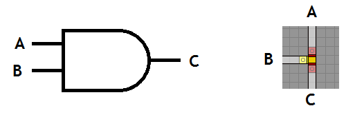

Because P silicon will not allow current to travel through N silicon unless the P silicon has current, NPN gates are basically just AND gates.

You can chain multiple crossings of P silicon to create a multi-input AND gate...\


NOT Gate
--------

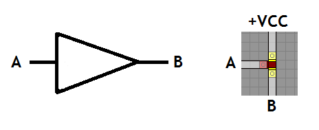

The same way an NPN gate is just an AND gate, a PNP gate is just a NOT gate. The P silicon carries current from a constant current source (which +VCC provides in the corners of the board). When current from the input is present in the N crossing, then the P silicon will no longer carry a current.

OR Gate
-------\
OR is a bit more complicated...\
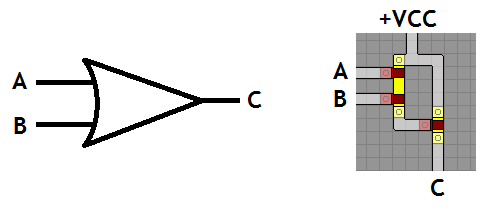

OR is like a not gate with multiple inputs. The P silicon carries a constant current, but if any of the inputs are active, then the final result will not have current. This is the opposite of the desired output, so adding an extra not gate at the end of this will result in an OR gate.

As you can see, even though most logic diagrams show OR as a fundamental unit, when it comes to actual circuits, it is easier to construct a NOR gate.\
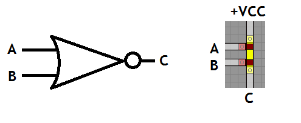

If you are feeling lazy, you can make a cheap-n-dirty OR gate by letting all inputs directly touch each other via a piece of metal or silicon...\
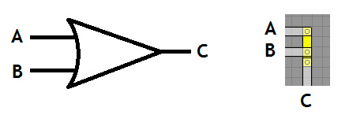

This is okay if the inputs aren't being used for any other purpose aside from being fed into this OR gate. When you do this, the current will go BACK into the sources and muck with things if you're using the input signals as inputs anywhere else, so use this design with caution.

Solutions
---------

> 
> The proposed solutions are only illustrative and not optimal.
> 

1 - KT411I QUAD INVERTER GATE
-----------------------------

This is just 4 NOT gates as described above.\
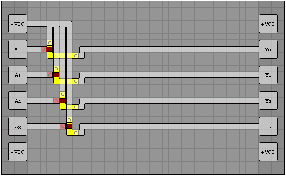

2 - KT221A DUAL 2-INPUT AND GATE
--------------------------------

This is just 2 AND gates as described above.\
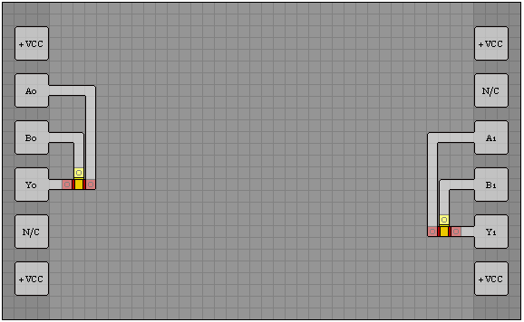

3 - KT141AO 4-INPUT AND/OR GATE
-------------------------------

The current going into X is an AND gate with 4 inputs as described above.\
The current going into Y is an OR gate with 4 inputs as described above.\
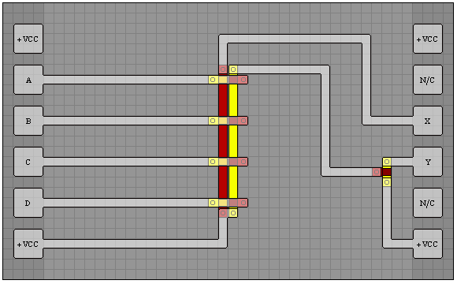

4 - KO229 POWER ON RESET GENERATOR
----------------------------------

Okay, so with this level, the warmup is over. Each time a circuit goes over a connection, there is a slight propagation delay. The purpose of this design is to exploit that delay. The current will not continue through the N silicon until the current has propagated through the P silicon at each connection. This accumulates the delay 10 times which is enough to make this test pass. The result from this chain is a current that is OFF for the first few moments, and then becomes ON once the propagation has reached it, which is the target for the /RST output. For the RST output, simply add a NOT gate to swap the /RST.\
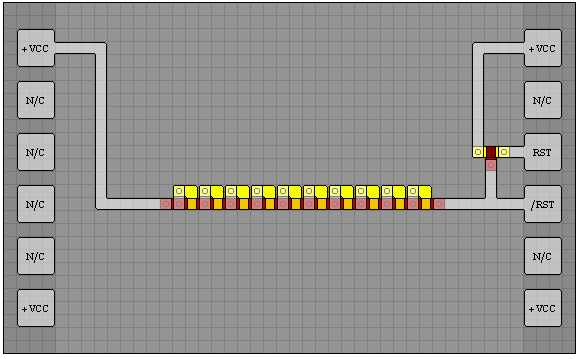

5 - KO223 DUAL FIXED FREQUENCY OSCILLATOR
-----------------------------------------

This is a similar concept. This oscillator will provide signal to the 2 AND gates below at first. Then as the signal propagates through the connections, eventually it will shut off the initial PNP gate and shut off the current to the beginning of the chain of NPN gates. This shut off will also propagate. Once it reaches the initial NPN gate again, current is allowed through again and the cycle repeats from the beginning giving it the oscillating effect.\


6 - KL2S1 DUAL TOGGLE LATCH
---------------------------

For this, you require knowledge of the SR latch...\
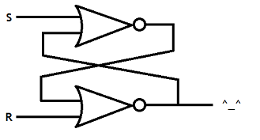

This one is hard to explain, so just stare at it for 3 minutes.\
Done? Good. These two NOR gates is one bit of memory. The input from S determines which value to store in the SR latch. When the R(eset) signal is set, then the value of S is stored in the overall circuit. When R goes off, the original value remains stored in the circuit, no matter what value being sent through S.\
Challenge 6 calls for two toggle latches, which means 4 NOR gates like the ones below. This is a relatively compact layout but is the same structure as the diagram above, twice.\
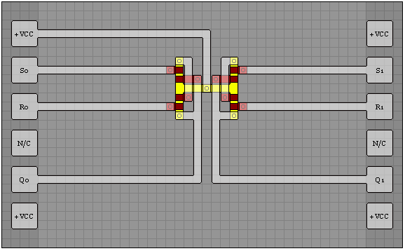

8 - KO224X DUAL FREQUENCY OSCILLATOR
------------------------------------

Here we have two oscillators like the one in challenge 5. One has 9 delay loops and the other has 4. These give you the oscillating frequencies that appear in the expected output. After NOT'ing the input from S, you can AND S together with the faster frequency and AND the NOT S with the slower frequency. OR'ing these two results together gives you the final output. It looks complicated, but it's just a compound series of simple operations. It's just challenge 5 written twice.\
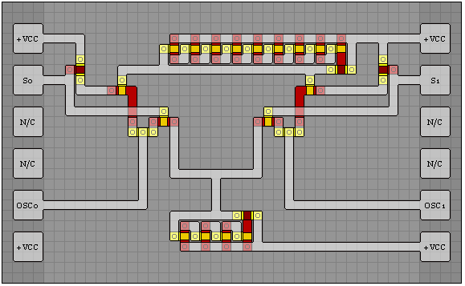

9 - KD124 2-TO-4 LINE DECODER
-----------------------------

This is just a series of 4 AND gates. I've split the 2 inputs of A and B into 4: A, B, NOT A, and NOT B.\
The B inputs come in from the left and the A inputs come down from the top.\
The inputs for the top AND gate are NOT A and NOT B.\
Etc.\
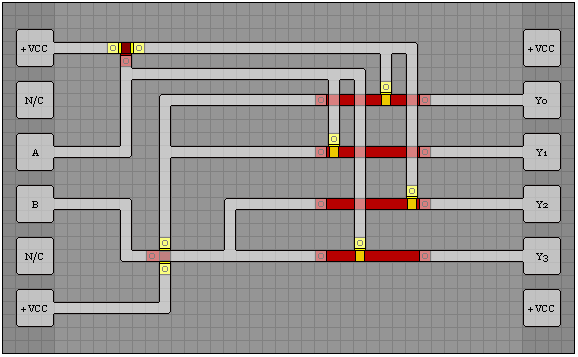

10 - KA18O 2-BIT ADDER WITH CARRY
---------------------------------

Don't panic.\
First look at the top right. S0 will only be 1 when either A0 or B0 are 1, but not both. This is a XOR gate. This is achieved by two NOR gates OR'ed together. This is a lazy OR gate I was talking about earlier since both NOR's meet in the middle of it.\
For the rest of the outputs, I simply enumerated the results into a chart of sorts. Each column of N silicon is an AND gate containing 2 or 3 inputs from A1, NOT A1, B1, NOT B1, (A0 AND B0), or NOT (A0 AND B0). A0 and B0 are not included individually because alone, they cannot influence the 2nd binary digit of the addition. They both must be set.\
The left 4 AND gates determine S1. If exactly 1 of the inputs is on or all 3 are on, then S1 is on. There are 4 combinations that could cause this, so 4 AND gates. They are all lazy-OR'ed together at the top and then sent to S1.\
The right 3 AND gates determine the Carry bit. The Carry bit is lit when at least 2 of the inputs are carrying current. There are 3 combinations for this, so they are enumerated, lazy-OR'ed, and sent to C.\
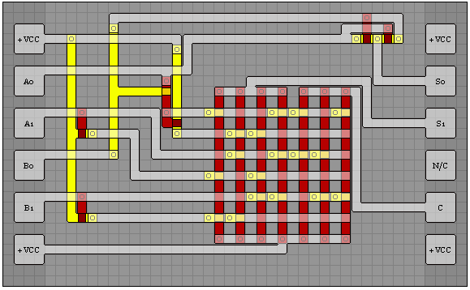
