# Pharo Chip Designer
A little chip design game inspired by (KOHCTPYKTOP: Engineer of the People)[http://www.zachtronics.com/kohctpyktop-engineer-of-the-people/] by Zachtronics


## How to load

The Pharo Chip Designer runs withing Pharo 8.0 environment. Currently, it is not provided as a standalone application because the main purpose of it is not to imitate the original game but to provide a base for own experiments where you want to have full control over the input and output signals. Pharo provides an interactive environment for it. So you first should install Pharo Launcher, then prepare a Pharo 8.0 image and load the Chip Designer into it.

1) Install Pharo Launcher from http://pharo.org/download)
2) Create a new image from the template named "Pharo 8.0 - 64bit" (32bit can be used too. Pharo 8.0 is currently the development version, but it has many improvements in the UI building that are used in the Chip Designer)
3) Run the image, open Playground (Tools - Playground), place the following code there, select it and from the context menu choose "Do it"

```smalltalk
Metacello new
  baseline: 'ChipDesigner';
  repository: 'github://pavel-krivanek/PharoChipDesigner/src';
  load.
```

In the Pharo welcome window, you can select the prefered theme (light or dark).

## Controls

|  | Normal mode |
| ------ | ------ |
| LMB | metal |
| RMB | N silicon (red) |
| Shift + RMB | P silicon (yelow) |
| V | next LMB will add a via |
| X | delete mode |
| S | single step |
| R | run simulation |

|  | Delete mode |
| ------ | ------ |
| LMB | delete metal |
| Shift + LMB | delete silicon |
| X | normal mode |


## Introduction

>
> The following text is a modified vesion of an article describing the original game that was published on [https://nerdparadise.com/](https://nerdparadise.com) where it is no longer accessible. It can be visited on [archive.org](https://web.archive.org/web/20160404141949/http://nerdparadise.com/tech/electronics/circuits/kohctpyktop/)
>

When you start the program, you are given a handful of circuit specifications and are expected to create them on the surface provided. You have metal inputs (pads) on the left and metal receivers for outputs on the right. On the top, you have a little toolbar where you can select the input mode of the elements that you can then place the board (substrate).

In the tabs below, you can choose between the specification of the circuit and scopes you can run some tests to determine if your circuit works.

So back to laying down metal and silicon...


All these materials are capable of carrying current, but only metal can connect to the inputs or outputs...


Metal and silicon can pass over each other on the board without the currents from each interferring unless you add a connector (the little circle thing, 3rd in your toolbox). However, when you try to cross two different colors of silicon, you get something like this...


This is a gate.

There are two sorts of gates...

NPN Gate
--------


Ordinarily silicon will let current travel like metal, but if P (yellow) silicon crosses N (red) silicon, current will only travel through the N (red) silicon if the P (yellow) silicon is also carrying a current. Otherwise, the N (red) silicon will not carry a current across.

PNP Gate
--------


This is just the opposite. When N silicon crosses P silicon, current will not continue through if the N silicon is carrying a current. Red has to have no current in order for yellow to carry its current across.

From these fundamental concepts, traditional logic gates can be constructed.

AND Gate
--------


Because P silicon will not allow current to travel through N silicon unless the P silicon has current, NPN gates are basically just AND gates.

You can chain multiple crossings of P silicon to create a multi-input AND gate...\


NOT Gate
--------


The same way an NPN gate is just an AND gate, a PNP gate is just a NOT gate. The P silicon carries current from a constant current source (which +V<sub>CC</sub> provides in the corners of the board). When current from the input is present in the N crossing, then the P silicon will no longer carry a current.

OR Gate
-------\
OR is a bit more complicated...\


OR is like a not gate with multiple inputs. The P silicon carries a constant current, but if any of the inputs are active, then the final result will not have current. This is the opposite of the desired output, so adding an extra not gate at the end of this will result in an OR gate.

As you can see, even though most logic diagrams show OR as a fundamental unit, when it comes to actual circuits, it is easier to construct a NOR gate.\


If you are feeling lazy, you can make a cheap-n-dirty OR gate by letting all inputs directly touch each other via a piece of metal or silicon...\


This is okay if the inputs aren't being used for any other purpose aside from being fed into this OR gate. When you do this, the current will go BACK into the sources and muck with things if you're using the input signals as inputs anywhere else, so use this design with caution.

FAQ
---------

**Question:** Does the way how the chip layout is done in the Pharo Chip Designer correspond to the real-life chip design?

**Super-short answer:** 
No

**Short answer:** 
No, it is just an educational game. The real-life chip design is several orders of magnitude more complicated. But the simplifications make it more fun while you still can learn the basic principles and face to some practical problems that many logical simulators do not take into account.

**Very long answer:**
The voltage is the difference in electric potential between two points. It is crucial to keep in mind that you need two points to measure voltage. If you look at the resistors in series, you will measure potential differences depending on positions of the measuring points. In the electric circuits, you usually use a voltage source like a battery, so the potential difference of its two outputs is the most interesting voltage value for you. Because the voltage needs two points to be measured, some circuit simulators like LTspice forces you to define in the circuit a referencing point, the ground (⏚), although the circuit itself has no real ground connection and is powered only from a battery. I mention this because the relation between the ground and battery outputs may be confusing for novices.

An interesting situation occurs when you have an open circuit - like a circuit with a switch in the off state. It may be seen as a circuit where there is a resistor with an infinite resistance or in practice, with a very big value. Then, between the two points, there will be the same potential difference as the voltage source has, independently on the other resistor values (if they are not huge too). Why? If you look at the resistors in series, the voltage divider, the voltage drop of the resistor is directly proportional to its resistance. If you increase the resistance of one of the resistors, the others become proportionally less important. If the resistance value is enormous as in case of open circuit, the voltage drop is practically equal to the potential of the voltage source.

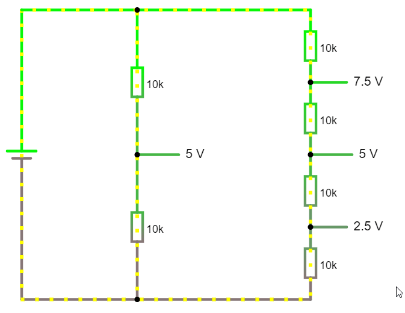

In the digital circuits, we interpret one voltage value as logical 1 and another voltage value as logical 0. For example, it may be 5V and 0V (in reality, some range is accepted, like 0V-0.5V). If you put voltage measuring point before the switch in an open circuit, you will find voltage 5V there - "the logical high". If you turn on the switch, you will close the circuit and produce a short circuit because, in the circuit, we have nothing more than a battery and the switch. The current will not need to overcome almost any resistance so it will grow to significant values and depending on the properties of your current source, it may destroy the circuit components. 

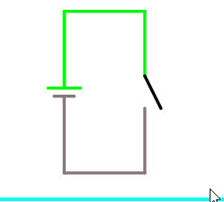

For this reason, we need to add some resistor to limit the current. We will add it before the switch itself. Now, when we turn on the switch, we will connect the area before the switch with the ground so the voltage there will immediately drop to zero. 

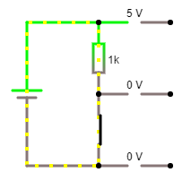

You may ask why we do not put the resistor behind the switch or why we do not measure the voltage before resistor. It is because, in the closed state, every additional resistor close to ground increases the voltage on the switch while we want to keep it as close to zero as possible.

Transistors are electronic components that behave like such switch (in digital circuits). The main difference is that we do not control it by hand but by another voltage. The transistor has three pins. The one that controls its state is named "base".  When there is no voltage on the base pin, the transistor stays in the closed state that corresponds to the switch that is turned off. When we bring a voltage on the base of the transistor, it will start to behave as a switch in "on" state - it will close the circuit. (For hairsplitters, what I wrote in this paragraph is a simplification and only partially true). 

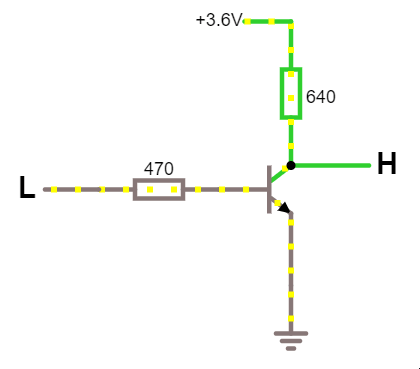

There is a lot of ways how the logical circuits may be constructed and the most basic ones we name "logical families". The RTL logical family works precisely this way. As you may see, the voltage that we get is opposite to the voltage on base. The transistor behaves as an inverter of it.

Before the era of integrated circuits when transistors were expensive, the RTL family was very popular. But it has many drawbacks. It is characterized by poor noise margin, poor fan-out capability (only a low amount of other elements can be connected to the logical output), low speed and high power. Other logical families replaced it. Very popular was (and still is) the TTL logical family that added other transistors to improve the circuit characteristics.

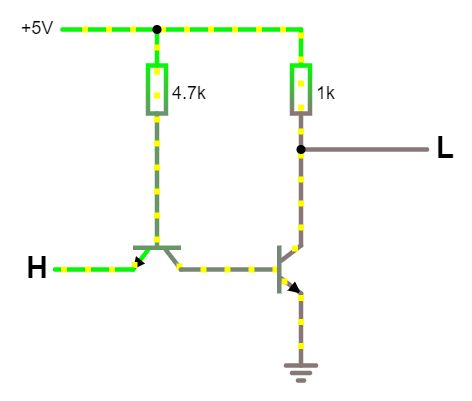

The way how the new transistor is connected may seem strange because we use one transistor input as an output. In fact, in this circuit, this transistor behaves more or less like two diodes. 

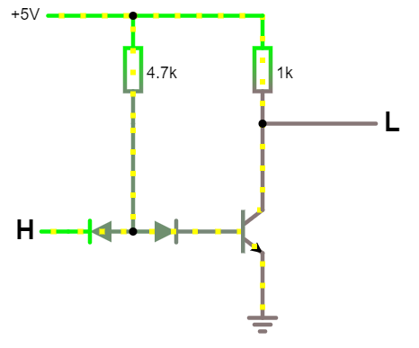

In reality, even this connection has some drawbacks so, in practice, another even more complicated one is used. 

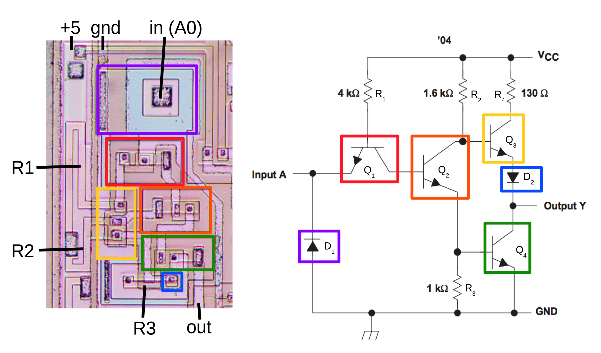

In this picture, you may see the real chip layout of such inverter. Compare it with the inverter constructed in the Pharo Chip Designer. 

As you see, it looks much more complicated. However, we need to take one fact into account. The chip layout design above is based on the TTL logic family that is usually quite complicated. I mentioned it first because the Pharo Chip Designer follows the original kohctpyktop naming and uses "V<sub>CC</sub>" for the power-supply pins. This is used for integrated circuits based on bipolar junction transistors. The NMOS, PMOS and CMOS families use by default the name "V<sub>DD</sub>". The original game is chronologically placed at the beginning of the '90s. The integrated circuit designs based on TTL logic were already not so common in that time and the name "V<sub>CC</sub>" is very often used in datasheets of components based on CMOS too so we should not take it too seriously.

So, let's take a step back and let's look at it in the context of MOSFET based integrated circuits. From the chip layout design perspective, they look simpler than TTL and are closer to the Pharo Chip Designer experience.

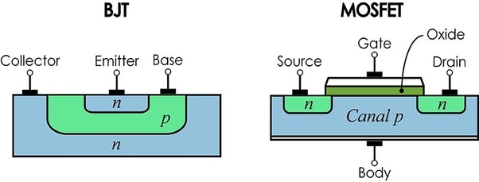

The bipolar junction transistors used in RTL and TTL families have a visible three-dimensional structure. The emitter is surrounded by the base that is surrounded by the collector. You can see in the picture above how such structure looks in the microscope from the top view. FET use different physical mechanisms for switching. The gate (that has a similar purpose as the base in BJT) creates an electric field under itself that forces electrons to move to a bigger distance and they open a conductive channel between the two other transistor ports. The size of this channel depends on the voltage level on the gate.  

The basic functionality of the transistor is still the same. You need a limiting resistor and measure voltage "above" it. In the NMOS circuits that were dominant in times when processors like 6502 or Z80 were created, often uses another transistor on the place of the resistor. This transistor is named "pull-up transistor". 


It has a slightly different internal structure (it is in the depletion mode), and it has the opposite behaviour. The bigger voltage on the gate causes greater resistance. Unfortunately, under the microscope they look the same as standard (enhancement mode) transistors so to identify them during reverse engineering of the chip layouts is not always straightforward. 

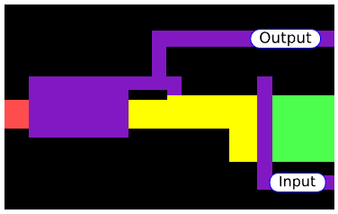


The CMOS technology uses PMOS transistors on the place of the pull-up transistors which brings some other technical advantages and new problems. 


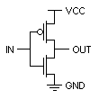

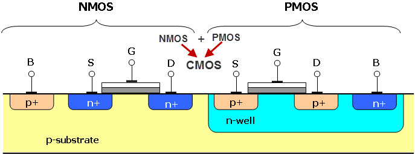

If you omit these pull-up transistors, the Pharo Chip Designer is not so far from the design of old NMOS integrated circuits. But it should be seen as a unique logic family created for educational purposes with own properties and design principles.

**Question:** Can any digital circuit be constructed in the Pharo Chip Designer

**Answer:** Yes, if you omit the size limitations.

The Pharo Chip Designer has two main components, PNP junction and PNP junction. They do not really correspond to the behavior of real transistors. PNP behaves as AND gate while NPN junction is used mostly in the role of an inverter. The combination of AND and inverter can produce NAND gate that has functional completeness so any other logical function can be constructed using it. The other well known-function of this type is NOR.

But the NPN junction is not an inverter, in fact, it is `(A & ~B)`. The junction operates as an inverter of B only if the V<sub>CC</sub> (A) is connected. This function is a universal gate too so the AND gate can be constructed using it

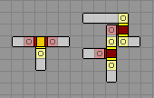

However, because of the propagation delay, this circuit has worse timing characteristic.

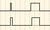

SRAM cell
---------


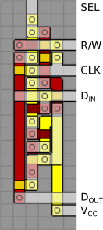

Solutions
---------

> 
> The proposed solutions are only illustrative and not optimal.
> 

1 - KT411I QUAD INVERTER GATE
-----------------------------

This is just 4 NOT gates as described above.\


2 - KT221A DUAL 2-INPUT AND GATE
--------------------------------

This is just 2 AND gates as described above.\


3 - KT141AO 4-INPUT AND/OR GATE
-------------------------------

The current going into X is an AND gate with 4 inputs as described above.\
The current going into Y is an OR gate with 4 inputs as described above.\


4 - KO229 POWER ON RESET GENERATOR
----------------------------------

Okay, so with this level, the warmup is over. Each time a circuit goes over a connection, there is a slight propagation delay. The purpose of this design is to exploit that delay. The current will not continue through the N silicon until the current has propagated through the P silicon at each connection. This accumulates the delay 10 times which is enough to make this test pass. The result from this chain is a current that is OFF for the first few moments, and then becomes ON once the propagation has reached it, which is the target for the /RST output. For the RST output, simply add a NOT gate to swap the /RST.\


5 - KO223 DUAL FIXED FREQUENCY OSCILLATOR
-----------------------------------------

This is a similar concept. This oscillator will provide signal to the 2 AND gates below at first. Then as the signal propagates through the connections, eventually it will shut off the initial PNP gate and shut off the current to the beginning of the chain of NPN gates. This shut off will also propagate. Once it reaches the initial NPN gate again, current is allowed through again and the cycle repeats from the beginning giving it the oscillating effect.\


6 - KL2S1 DUAL TOGGLE LATCH
---------------------------

For this, you require knowledge of the SR latch...\


This one is hard to explain, so just stare at it for 3 minutes.\
Done? Good. These two NOR gates is one bit of memory. The input from S determines which value to store in the SR latch. When the R(eset) signal is set, then the value of S is stored in the overall circuit. When R goes off, the original value remains stored in the circuit, no matter what value being sent through S.\
Challenge 6 calls for two toggle latches, which means 4 NOR gates like the ones below. This is a relatively compact layout but is the same structure as the diagram above, twice.\


8 - KO224X DUAL FREQUENCY OSCILLATOR
------------------------------------

Here we have two oscillators like the one in challenge 5. One has 9 delay loops and the other has 4. These give you the oscillating frequencies that appear in the expected output. After NOT'ing the input from S, you can AND S together with the faster frequency and AND the NOT S with the slower frequency. OR'ing these two results together gives you the final output. It looks complicated, but it's just a compound series of simple operations. It's just challenge 5 written twice.\


9 - KD124 2-TO-4 LINE DECODER
-----------------------------

This is just a series of 4 AND gates. I've split the 2 inputs of A and B into 4: A, B, NOT A, and NOT B.\
The B inputs come in from the left and the A inputs come down from the top.\
The inputs for the top AND gate are NOT A and NOT B.\
Etc.\


10 - KA18O 2-BIT ADDER WITH CARRY
---------------------------------

Don't panic.\
First look at the top right. S0 will only be 1 when either A0 or B0 are 1, but not both. This is a XOR gate. This is achieved by two NOR gates OR'ed together. This is a lazy OR gate I was talking about earlier since both NOR's meet in the middle of it.\
For the rest of the outputs, I simply enumerated the results into a chart of sorts. Each column of N silicon is an AND gate containing 2 or 3 inputs from A1, NOT A1, B1, NOT B1, (A0 AND B0), or NOT (A0 AND B0). A0 and B0 are not included individually because alone, they cannot influence the 2nd binary digit of the addition. They both must be set.\
The left 4 AND gates determine S1. If exactly 1 of the inputs is on or all 3 are on, then S1 is on. There are 4 combinations that could cause this, so 4 AND gates. They are all lazy-OR'ed together at the top and then sent to S1.\
The right 3 AND gates determine the Carry bit. The Carry bit is lit when at least 2 of the inputs are carrying current. There are 3 combinations for this, so they are enumerated, lazy-OR'ed, and sent to C.\

